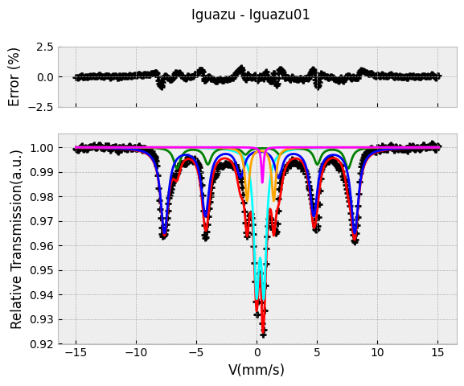

# PyMossFit: A Google Colab option for Mössbauer Spectra Fitting

# Summary
Mössbauer spectroscopy is a highly specialized technique that investigates the resonant absorption of gamma rays by atomic nuclei. The Mössbauer effect, observed primarily in isotopes like iron-57 ($^{57}Fe$), provides insight into hyperfine interactions, including isomer shifts, quadrupole splittings, and magnetic hyperfine fields. These parameters offer detailed information about the electronic, magnetic, and structural environment of the sample, making the technique invaluable in material science, chemistry, and condensed matter physics. The gamma ray of resonant absorption in $^{57}Fe$ nuclei is *14.4 keV* 

In a typical Mössbauer experiment, a radioactive source emits gamma rays, which are absorbed by the nuclei in the sample. Resonant absorption occurs, in a small fraction, when gamma rays hit the probe with recoil less. The detector measures the intensity of the transmitted radiation as a function of the velocity of the gamma-ray source. This results in a Mössbauer spectrum, typically characterized by sharp peaks or dips at resonance frequencies, corresponding to different hyperfine interactions within the sample. The most common experimental setup corresponds to *Transmission Geometry* (in this case, the observed lines come from a reduction of *14.4 keV* gamma counting in detector, as compared to the background signal). Other option is the *Conversion Electron Mössbauer Spectroscopy (CEMS)* that correspond to detection of back scattered electrons after gamma absorption. 

Recently, in a review written by Grandjean et al [[Grandjean2021]](https://doi.org/10.1021/acs.chemmater.1c00326),the authors made a series of suggestion about how good measurements should be taken and which could be a good practice for Mössbauer data treatment and its corresponding fitting presentation.
Usually, scientist working with Mössbauer Spectroscopy manage their data and fit them with not open source softwares that run in Windows OS with low update services. The need of an open source option with less OS or package dependency motivated this work.

In this sense, Google Colab is a useful tool for a colaborative team job in data analysis with the aditional advantage of no aditional packages locally installed, also compatible with the fact that the user can run their codes from multiple devices.

# Mössbauer Spectra and Curve Shapes
The shape of a Mössbauer spectrum varies depending on the nature of the hyperfine interactions in the sample. For example, a simple paramagnetic material might produce a single absorption peak (Lorentzian, Gaussian  or PseudoVoigt) due to the isomer shift. Materials with quadrupole splitting generate a doublet (two peaks), while materials experiencing magnetic hyperfine interactions often exhibit more complex sextet patterns. These spectral features often overlap, making it challenging to isolate and quantify each component manually.

Curve fitting plays a crucial role in Mössbauer spectral analysis, as it allows for the decomposition of these complex spectra into individual contributions, each associated with specific hyperfine parameters. The challenge lies in accurately reproducing the spectral shapes using mathematical models and adjusting the parameters until a satisfactory fit is achieved.

# Curve Fitting and Least Squares Method
To accurately extract physical parameters from Mössbauer spectra, fitting procedures are applied to the experimental data. One of the most common approaches is the *least-squares method*, which minimizes the difference between the experimental data points and the theoretical model curve. The objective is to adjust the parameters of the theoretical model (such as isomer shift, quadrupole splitting, and line broadening) so that the calculated spectrum fits the experimental data as closely as possible. Then, it is required a minimization of the $\chi^2$, defined as:

$$\chi^2=\sum_{i=1}^{N}\frac{(y_i^{exp}-y_i^{model}(\vec{p}))^2}{\epsilon_i^2}$$

In Python, this process can be implemented using libraries like *Lmfit*, *SciPy*, or *NumPy*, which provide robust tools for least-squares curve fitting. The general approach involves defining a model function that represents the expected shape of the Mössbauer spectrum, which could be a sum of multiple Lorentzian or Gaussian functions, depending on the number and type of spectral components. Lorentzian functions are preferred with crystalline samples, while PseudoVoigts (sum of Lorentzian and Gaussian functions) are appropriated for Fe sites in disordered materials. The least-squares fitting algorithm iteratively adjusts the parameters of the model until the sum of squared residuals between the experimental and calculated spectra is minimized.

# Description of the Python code for Google Colab (PyMossFit)
The Python code is available in several Jupyter notebooks as typical examples found in practice. Some selected parts of it are described througout this page.
[[Saccone2024a]](https://github.com/fsacconeUBA/Mossbauer/releases/tag/PyMossFit-V3)[[Saccone2024b]](http://dx.doi.org/10.13140/RG.2.2.20717.81127). (The comments and code section headings are in spanish)

The code is structured in three cells. The first one includes the installation of *Lmfit*, the core of data fitting. Also, it imports some packages of *Scipy*, *Pandas*, *Matplotlib* and *Numpy*, among others. The next step, includes a Drive connection which asks permission to user.

The second cell, reads the datafile (format should be inspected previously to define "delimiter", "columns" and "skiprows" parameters). The required inputs are date (in a YYYYMMDD format) and maximum velocity asociated to the extreme channels.
In this cell, the spectrum folding is performed with a Discrete Fourier Transforming routine, the Numpy fft. The theory of this procedure corresponds to the Nyquist-Shannon Sampling Theorem that helps to determine a folding channel from the symmetry of Discrete Fourier spectra [[Kong2020]](https://pythonnumericalmethods.studentorg.berkeley.edu/notebooks/chapter24.02-Discrete-Fourier-Transform.html). Also data can be smoothed by means of a Savitsky-Golay package (I use savgol from Scipy). After folding, a new datafile is saved for fitting with the use of the next cell. 

The set of parameters such as linewidth, isomer shifts, quadrupole splitting and hyperfine field are calculated after adjusting the amplitud (*a*), full width at half maximum (*b*), centroid (*m*), line shift (*d*) and line separation (*q*). Initial set of these parameters can be fitted or fixed by selecting the *"True*" or *"False"* options, respectively. A typical fit report of the output of this cell looks as following:

Finally, the code loads fitted parameters, experimental and modeled subespectra in CSV formatted files. One final cell, allows to identify the phases from an own database. The ML algorithm employed to guess the present phases is based on a K-Nearest Neighbors.

# Some Examples

![CEMS spectrum of pyroxene in Mars soil (Opportunity Mission, Sept. 2004, T= 240-260K) [[Morris2006]](https://doi.org/10.1029/2006JE002791). The subespectra correspond to two different $^{57}Fe$ sites, M1 and M2, tipically found in pyroxene. [[Oshtrakh2007]](https://doi.org/10.1007/s10751-008-9646-4)](Opportunity.png)

# References
[Mossbauer_Wikipedia] *Mössbauer Spectroscopy*, http://en.m.wikipedia.org/wiki/Mössbauer_spectroscopy

[Grandjean2021] Grandjean, F. and Long, G. J., *Best Practices and Protocols in Mössbauer Spectroscopy*,Chem. Mater. 2021, 33, 3878−3904 

[Saccone2024a] Saccone, F. D., Release of *PyMossFit* in Github, https://github.com/fsacconeUBA/Mossbauer/releases/tag/PyMossFit-V3

[Saccone2024b] Saccone, F.D., *PyMossFit*, ResearchGate, http://dx.doi.org/10.13140/RG.2.2.20717.81127

[Kong2020] Kong, Q; Siauw, T. and Bayen, A., *Python Programming and Numerical Methods - A Guide for Engineers and Scientists*, https://pythonnumericalmethods.studentorg.berkeley.edu/notebooks/Index.html

[Ferrari2015] Ferrari, S. et al, *Structural and magnetic properties of Zn doped magnetite nanoparticles obtained by wet chemical method*, IEEE Transactions on Magnetics, vol. 51, no. 6, pp. 1-6, June 2015, Art no. 2900206

[Morris2006] Morris, R. V., et al. (2006), *Mösbauer mineralogy of rock, soil, and dust at Meridiani Planum, Mars: Opportunity’s
journey across sulfate-rich outcrop, basaltic sand and dust, and hematite lag deposits*, J. Geophys. Res., 111, E12S15,

[Oshtrakh2007] Oshtrakh, M. I., *Determination of quadrupole splitting for 57Fe in M1
and M2 sites of both olivine and pyroxene in ordinary
chondrites using Mössbauer spectroscopy with high
velocity resolution*, Hyperfine Interact (2007) 177, pp. 65-71
